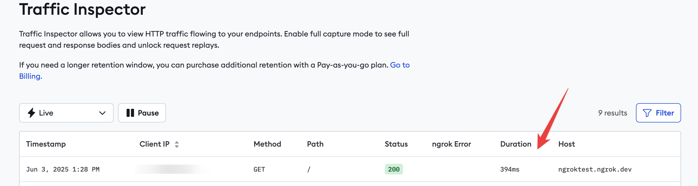

# Steps to reproduce

## Start sample API


```sh
docker network create ngrokTest

docker run --init --platform=linux/amd64 --rm -p 4000:80 --network=ngrokTest --name="api" -e PORT=80 joelatngrok/api-demo

```


- Create a file named `policy.yml` with the code below.

```yml
on_http_request:
  - actions:
      - type: rate-limit
        config:
          name: 1 request per minute
          algorithm: sliding_window
          capacity: 10
          rate: 1m
          bucket_key:
            - "hasReqHeader('host') ? getReqHeader('host')[0] : 'unknown'"
```

- Browse to the `Domains` page in the ngrok dashboard and register a domain
- Replace `https://your-domain-in-ngrok` in the command below with you domain registered in ngrok
- Replace the authentication token in the command below with [your token](https://dashboard.ngrok.com/get-started/your-authtoken)

```sh
docker run -it --rm --platform=linux/amd64 --network=ngrokTest -v ".:/app" -w "/app" -e NGROK_AUTHTOKEN=your-token ngrok/ngrok:3.22.0-alpine-amd64 http http://api --traffic-policy-file policy.yml --url https://your-domain-in-ngrok
```

The api should be accessible at your domain `https://your-domain-in-ngrok`


The requests will also show up in traffic inspector




## Monitor events with Datadog

- Sign up for a [Datadog account](https://www.datadoghq.com/)

- In **Step 3** of the Datadog sign-up, click on **Docker** in the sidebar. Copy and paste the given command into a terminal and run it.


- Once the Datadog site notices your agent is running, click **Finish** on the page.

- You now no longer need the agent running locally and can remove the Datadog container with the command below.


```sh
docker stop dd-agent
docker remove dd-agent
docker image rm gcr.io/datadoghq/agent:7
```

- Make a note of your Datadog API key, which you can access by clicking your username at the bottom left of the sidebar and clicking **API Keys** in the menu that opens.


- In the ngrok navigation panel, browse to the [Events Stream](https://dashboard.ngrok.com/event-subscriptions) and add a new subscription.

- In the New Event Subscription sidebar, enter `traffic` as the Description and then Add a new source. Choose `http_request_complete.v0`


- Add Datadog as a destination, choose you Datadog site region and API key you noted earlier, and send a test event.
- Open the Datadog site and browse to the **Log Explorer** page from the navigation panel. You should see that the test event from ngrok will appear.


- In ngrok, click **Done** and **Save** to save the event subscription.

Refresh your ngrok API page at `https://your-domain-in-ngrok` a few times so that new requests are logged in Datadog.


## What we expect to see 

New events being logged to Datadog


## What actually happens 


Events only show up in Datadog once the agent is run without specifying the traffic-policy-file flag as below


```sh
docker run -it --rm --platform=linux/amd64 --network=ngrokTest -v ".:/app" -w "/app" -e NGROK_AUTHTOKEN=your-token ngrok/ngrok:3.22.0-alpine-amd64 http http://api --url https://your-domain-in-ngrok
```


